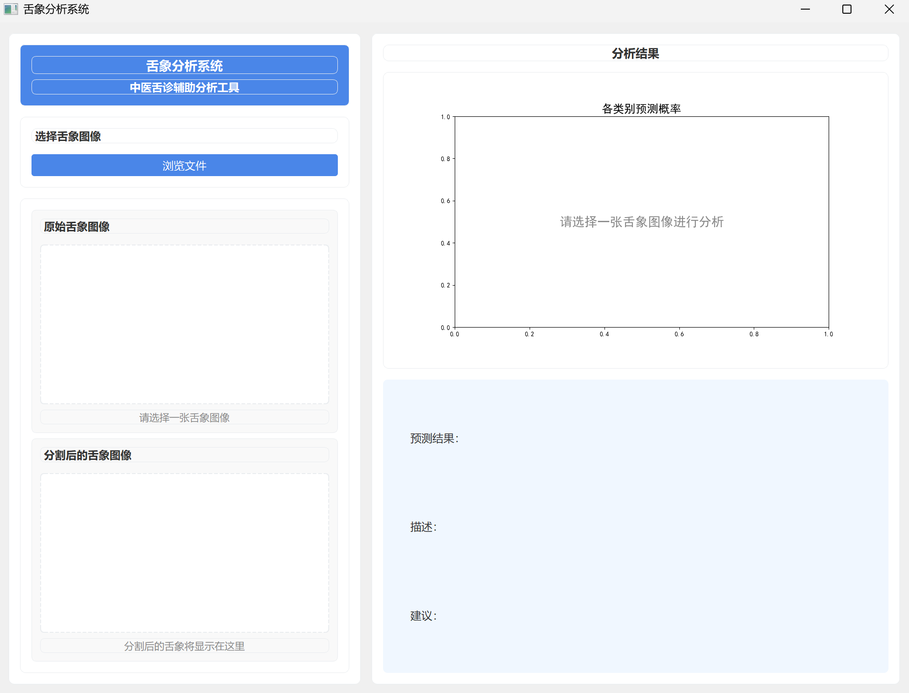

# 舌象分析系统

这是一个基于深度学习的舌象分析系统，可以对舌头图像进行分割和分类，帮助用户了解自己的舌象特征及相关健康建议。

## 项目概述

数据集来源：https://gitcode.com/open-source-toolkit/7542e/tree/main

本系统采用两阶段处理方式：
1. 首先使用分割模型识别并提取舌头区域
2. 然后使用分类模型对舌象进行分类，识别不同的舌象类型

系统可以识别以下舌象类型：
- 舌红、苔厚腻
- 舌白、苔厚腻
- 黑苔
- 地图舌
- 紫苔
- 舌红、黄苔、厚腻苔

## 安装依赖

```bash
pip install -r requirements.txt
```

## 数据集准备

1. 分割数据集：
   - 图像放在 `data/seg_data/images/` 目录
   - 标注放在 `data/seg_data/annotations/` 目录

2. 分类数据集：
   - 按类别组织在 `data/cls_data/train/` 和 `data/cls_data/test/` 目录下
   - 每个类别一个子文件夹

3. 原始数据集：
   - 放在`data/ori_data`目录


## 使用方法

### 1. 运行界面程序

请确保已完成分割模型和分类模型的训练，并将权重文件放在`config.py`指定的位置。

```bash
python main.py
```



界面操作说明：
1. 点击“选择图像”按钮上传舌头图像
2. 系统自动进行分割和分类处理
3. 查看分析结果和健康建议

---

### 2. 分割模型数据准备

1. 原始数据集放在`data/ori_data`目录下。
2. 生成mask和标准化图片名：

```bash
cd tools
python json2mask.py
```

### 3. 训练分割模型

```bash
cd src\training
python train_seg.py
```

训练完成后，模型权重和日志会自动保存在`output/segmentation/weights`和`output/segmentation/logs`等目录下。


### 4. 分类模型数据准备

1. 使用分割模型对原图像进行分割：

```bash
cd tools
python seg_crop.py
```

2. 划分数据集为训练集和测试集：

```bash
cd tools
python split_cls.py
```

### 5. 训练分类模型

```bash
cd src\training
python train_cls.py
```

训练完成后，模型权重和日志会自动保存在`output/classification/weights`和`output/classification/logs`等目录下。

### 6. 如果遇到路径问题，请根据实际情况自行调整路径


## 项目结构

```
tongue/
├── config.py           # 配置文件
├── data/               # 数据目录
│   ├── cls_data/       # 分类数据集
│   ├── seg_data/       # 分割数据集
│   └── ori_data/       # 原始数据
├── main.py             # 主程序入口
├── output/             # 输出目录
│   ├── classification/ # 分类模型输出
│   └── segmentation/   # 分割模型输出
├── src/                # 源代码
│   ├── datasets/       # 数据集定义
│   ├── models/         # 模型定义
│   ├── training/       # 训练脚本
│   ├── ui/             # 用户界面
│   └── utils/          # 工具函数
└── tools/              # 工具脚本
    ├── json2mask.py    # JSON标注转换为掩码
    ├── seg_crop.py     # 分割裁剪工具
    └── split_cls.py    # 划分分类数据集
```

## 模型

### 分割模型

使用 Segmentation Models PyTorch 库，基于 ResNet34 的 U-Net 架构。

### 分类模型

支持多种模型架构：
- ResNet
- EfficientNet
- Vision Transformer (ViT)


